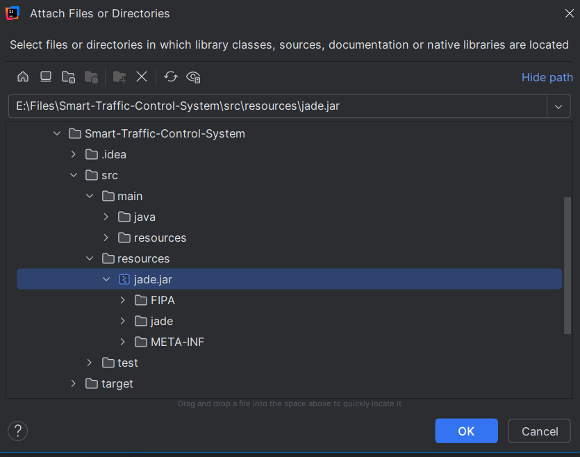
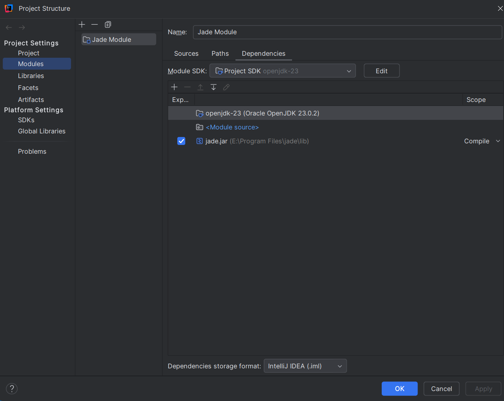
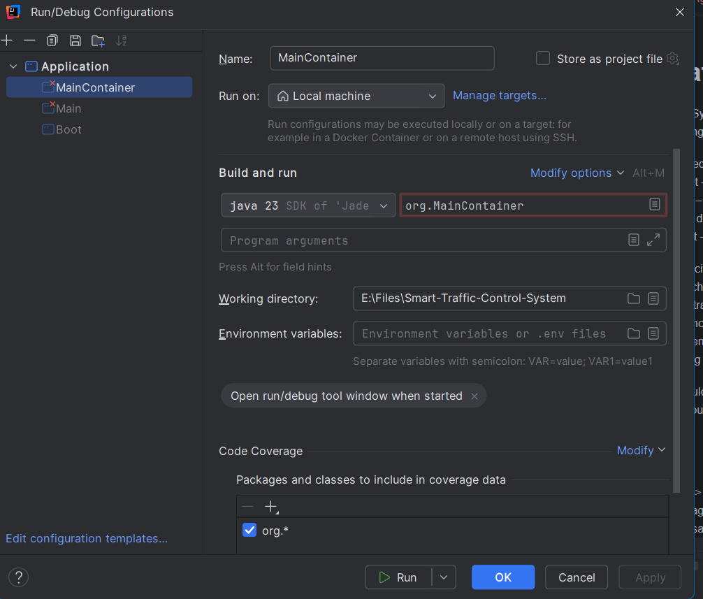
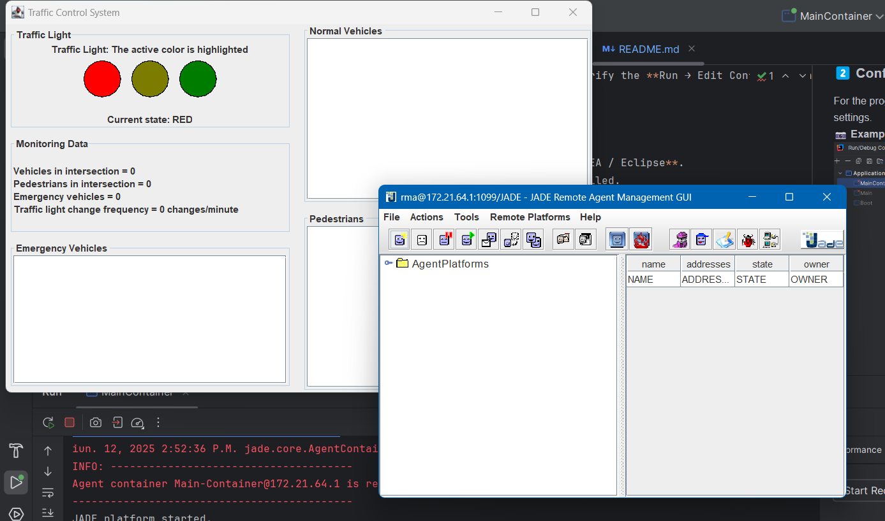
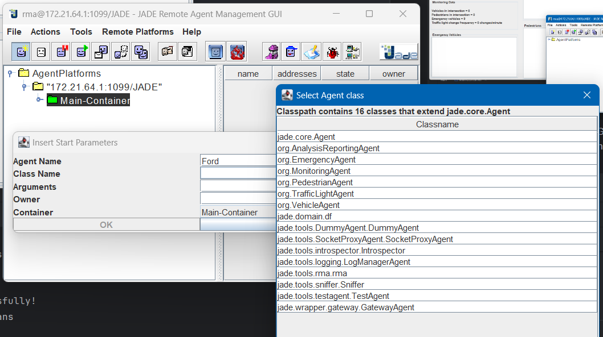

# **🚦 Smart Traffic Control System**
A **multi-agent system** designed to efficiently manage road traffic using autonomous agents developed in **JADE**.

## **📌 System Overview**
This intelligent system optimizes traffic flow through specialized agents:
- **Traffic Participant Agent (Vehicle/Pedestrian)** – Requests access to intersections.
- **Emergency Agent** – Signals priority vehicles (e.g., ambulances, police cars).
- **Traffic Light Agent** – Manages traffic light operations dynamically.
- **Monitoring Agent** – Collects and analyzes real-time traffic data.
- **Analysis & Reporting Agent** – Generates insights based on collected data.

## **🌍 Traffic Flow Interpretation**
### **Basic Pedestrian Crossing**
- **Linear traffic model** – No full intersection.
- **Traffic lights control one-directional movement only** (no turns).
- **Emergency vehicles always receive priority**, overriding traffic signals.

### **⚙️ How It Works**
The system **simulates an urban environment**, incorporating vehicles, sensors, and emergency scenarios:  
✔ **Adaptive Traffic Lights** – Signal durations adjust based on real-time traffic volume.  
✔ **Emergency Handling** – Ensures swift passage for priority vehicles.  
✔ **Real-time Monitoring** – Detects congestion and optimizes waiting times.

## **🛠️ Installation & Setup**
### **1️⃣ Install JADE**
Ensure **JADE** is installed and properly configured:
- Navigate to **File → Project Structure → Modules** to verify the JADE path.
- If missing, **click "Add" → Select "JAR" → Locate the JADE folder** → Apply & close.

📷 **Example Configuration:**  
  

### **2️⃣ Configure Run Settings**
- Open **Run → Edit Configuration** and ensure proper setup.

📷 **Example:**  

### **3️⃣ Build & Run**
1️⃣ Open the project in **IntelliJ IDEA / Eclipse**.  
2️⃣ Ensure all dependencies are installed.  
3️⃣ **Run `MainContainer`** to launch JADE agents.  
4️⃣ The JADE GUI will appear, showing all active agents. 
5️⃣ Navigate to "Agent Performs" → Select `"172.21.64.1.1099/JADE"` → Click `"MainContainer"`.  
6️⃣ In the new window, input **Agent Name** and **Class Name** (use the `"..."` button to browse).  
7️⃣ You **can only create agents of the following types**:
- **VehiculeAgent**
- **EmergencyAgent**
- **PedestrianAgent** 
